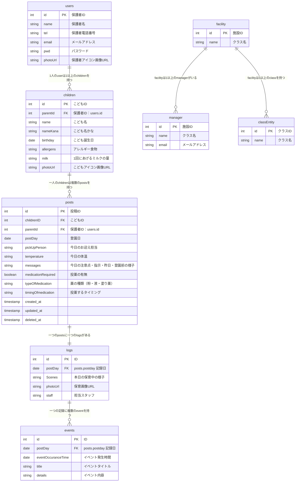

# ER図（Markdown形式）

## User

- id (PK)
- name
- tel
- email (UNIQUE)
- password
- photoUrl
- children → [Child]
- posts → [Post]

## Child

- id (PK)
- parentId (FK → User.id)
- name
- nameKana
- birthday
- allergens
- milk
- photoUrl
- posts → [Post]

## Facility

- id (PK)
- name
- classes → [Class]
- managers → [Manager]
- staff → [Staff]

## Class

- id (PK)
- name
- facilityId (FK → Facility.id)
- staff → [Staff]

## Manager

- id (PK)
- name
- email (UNIQUE)
- facilityId (FK → Facility.id)

## Staff

- id (PK)
- name
- email (UNIQUE)
- facilityId (FK → Facility.id)
- classId (FK → Class.id)

## Post

- id (PK)
- childId (FK → Child.id)
- parentId (FK → User.id)
- postDay
- pickUpPerson
- temperature
- messages
- medicationRequired
- typeOfMedication
- timingOfMedication
- log → Log (1:1)
- createdAt
- updatedAt
- deletedAt

## Log

- id (PK)
- postId (FK, UNIQUE → Post.id)
- scenes
- photoUrl
- staff
- events → [Event]
- createdAt
- updatedAt
- deletedAt

## Event

- id (PK)
- logId (FK → Log.id)
- eventOccurrenceTime
- title
- details
- createdAt
- updatedAt
- deletedAt

## ER画像（Mermaid形式）
