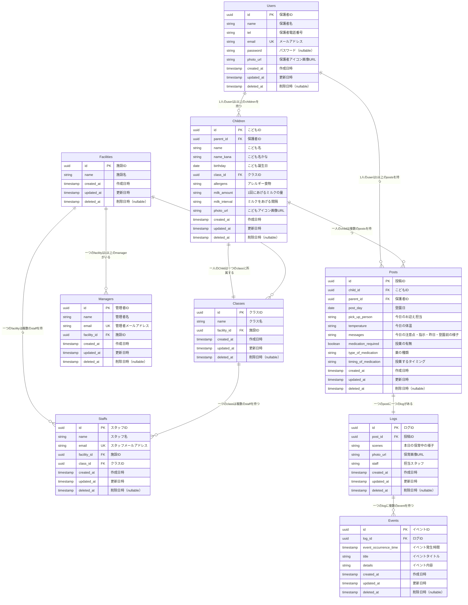

# ER図（Markdown形式）

## Users

- id (PK,UUID)
- name(TEXT)
- tel(TEXT,NULLABLE)
- email (TEXT,UNIQUE)
- password(TEXT,NULLABLE)
- photo_url(TEXT,NULLABLE)
- created_at (TIMESTAMP)
- updated_at (TIMESTAMP)
- deleted_at (TIMESTAMP, NULLABLE)
- children → [Children]
- posts → [Posts]

## Children

- id (PK,UUID)
- parent_id (FK → Users.id,UUID)
- name(TEXT)
- nameKana(TEXT,NULLABLE)
- birthday(DATE)
- class_id (FK → Classes.id,UUID)
- allergens(TEXT,NULLABLE)
- milk_amount(TEXT,NULLABLE)
- milk_interval(TEXT,NULLABLE)
- photo_url(TEXT,NULLABLE)
- created_at (TIMESTAMP)
- updated_at (TIMESTAMP)
- deleted_at (TIMESTAMP, NULLABLE)
- posts → [Posts]

## Facilities

- id (PK,UUID)
- name(TEXT)
- created_at (TIMESTAMP)
- updated_at (TIMESTAMP)
- deleted_at (TIMESTAMP, NULLABLE)
- classes → [Classes]
- managers → [Managers]
- staff → [Staffs]

## Classes

- id (PK,UUID)
- name(TEXT)
- facility_id (FK → Facilities.id,UUID)
- created_at (TIMESTAMP)
- updated_at (TIMESTAMP)
- deleted_at (TIMESTAMP, NULLABLE)
- children → [Children]
- staff → [Staffs]

## Managers

- id (PK,UUID)
- name(TEXT)
- email (TEXT,UNIQUE)
- facility_id (FK → Facilities.id,UUID)
- created_at (TIMESTAMP)
- updated_at (TIMESTAMP)
- deleted_at (TIMESTAMP, NULLABLE)

## Staffs

- id (PK,UUID)
- name(TEXT)
- email (TEXT,UNIQUE)
- facility_id (FK → Facilities.id,UUID)
- class_id (FK → Classes.id,UUID)
- created_at (TIMESTAMP)
- updated_at (TIMESTAMP)
- deleted_at (TIMESTAMP, NULLABLE)

## Posts

- id (PK,UUID)
- child_id (FK → Children.id,UUID)
- parent_id (FK → Users.id,UUID)
- postDay(DATE)
- pick_up_person(TEXT,NULLABLE)
- temperature(TEXT,NULLABLE)
- messages(TEXT,NULLABLE)
- medication_required(BOOLEAN,DEFAULT FALSE)
- type_of_medication(TEXT,NULLABLE)
- timing_of_medication(TEXT,NULLABLE)
- created_at (TIMESTAMP)
- updated_at (TIMESTAMP)
- deleted_at (TIMESTAMP, NULLABLE)
- log → Logs (1:1)

## Logs

- id (PK,UUID)
- postId (FK, UNIQUE → Posts.id,UUID)
- scenes (TEXT, NULLABLE)
- photo_url (TEXT, NULLABLE)
- staff (TEXT, NULLABLE)

- created_at (TIMESTAMP)
- updated_at (TIMESTAMP)
- deleted_at (TIMESTAMP, NULLABLE)
- events → [Events]

## Events

- id (PK,UUID)
- logId (FK → Logs.id,UUID)
- event_occurrence_time (TIMESTAMP)
- title (TEXT)
- details (TEXT, NULLABLE)
- created_at (TIMESTAMP)
- updated_at (TIMESTAMP)
- deleted_at (TIMESTAMP, NULLABLE)

## ER画像（Mermaid形式）
